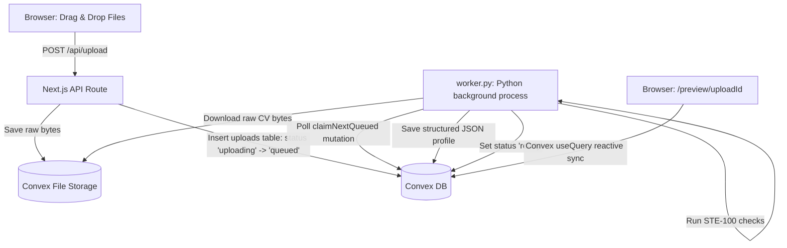

# AI Agent Guideline & Codebase Blueprint

Welcome, AI Agent! This document maps out the system architecture, file index, Convex schemas, and critical guardrails to help you navigate, edit, and extend the **easyCV** codebase safely and efficiently.

---

## 🗺️ System Overview & Workflow

The platform operates as a hybrid Next.js + Python application with a Convex database backend:



1. **User Uploads CVs**: Frontend uploads `.pdf`/`.txt`/`.md` files to `/api/upload`.
2. **Convex Queuing**: Next.js inserts an `uploads` row with status `uploading`, uploads files to Convex Storage, links them in `resumeFiles`, and transitions the job to `queued`.
3. **Python Worker Polling**: `worker.py` (running as a persistent daemon process) polls the Convex database via `claimNextQueued` (mutation protected by `WORKER_SECRET`).
4. **LLM Extraction**: The worker downloads files, extracts text, consolidates them into a unified JSON schema, compiles the resume into PDF/Markdown/LaTeX using `pipeline.py` and `latex.py`, and uploads the final PDF back to Convex Storage.
5. **Quality Scoring**: The worker runs quality checks in `pipeline.py`, which integrates the `ste100.py` rule engine to check for ASD-STE100 Issue 9 compliance.
6. **Reactive UI Update**: The Next.js frontend previews the resume live in `/preview/[uploadId]`. It checks payments status and allows downloading the final PDF via a one-time Stripe checkout or admin bypass token.

---

## 📁 Key File Index

- [`pipeline.py`](file:///Users/fource/bytecats/easycv/pipeline.py): CLI commands, main LLM prompt structures (`LLM_CONSOLIDATE_SYSTEM` & `LLM_RESUME_SYSTEM`), and resume scoring logic.
- [`ste100.py`](file:///Users/fource/bytecats/easycv/ste100.py): ASD-STE100 Issue 9 Simplified Technical English style, grammar, and word-count checking engine.
- [`latex.py`](file:///Users/fource/bytecats/easycv/latex.py): Renders structured JSON to LaTeX and compiles them to PDFs.
- [`worker.py`](file:///Users/fource/bytecats/easycv/worker.py): Asynchronous worker polling loop claimed from Convex.
- [`web/convex/schema.ts`](file:///Users/fource/bytecats/easycv/web/convex/schema.ts): Convex database table structures.
- [`web/convex/admin.ts`](file:///Users/fource/bytecats/easycv/web/convex/admin.ts): Admin management functions (bypass payment, retry job, delete upload).
- [`web/app/admin/page.tsx`](file:///Users/fource/bytecats/easycv/web/app/admin/page.tsx): Admin console interface.
- [`web/instrumentation.ts`](file:///Users/fource/bytecats/easycv/web/instrumentation.ts): OpenTelemetry serverless metrics tracer.

---

## 🛡️ Critical Guardrails & Rules

### 1. Convex Access Control & Security
- **No Direct Payments Gating on Client-Side**: Payment validation relies on `getByDownloadToken` query. Never trust client state for download authorization.
- **Session Cookie Isolation**: All user upload queries MUST include the browser's `sessionId` and verify ownership using the helper `ownedUpload` inside `convex/authz.ts`.
- **Public vs Internal Mutations**: Webhook handling (`markPaymentPaid`) must remain an **internalMutation** callable only by the signed Stripe callback in `convex/http.ts`. Do not expose it as a public mutation.
- **Worker Secret**: Python worker queries must verify `workerSecret` against `WORKER_SECRET` env var before transitioning jobs.

### 2. LaTeX Shell Safety
- `latex.py` compiles `.tex` using `pdflatex`. All strings interpolated into LaTeX files MUST be properly escaped to prevent LaTeX command injection or shell escapes.

### 3. Analytics & Tracing
- All pageview actions, file uploads, and checkout updates are tracked via **PostHog** (`usePostHog()` hooks in frontend React components). Keep telemetry events updated when creating new forms.

---

## ⚙️ Development, Testing & Codegen Commands

### Frontend & Convex
```bash
cd web

# Start Next.js and Convex local dev
bun run dev

# Run Convex codegen (regenerates type definitions in web/convex/_generated)
bunx convex codegen

# Run Vitest web test suite
bun run test

# Verify TypeScript compilation compiles cleanly
bun run typecheck
```

### Python Backend
```bash
# Run backend pytest suite
uv run pytest

# Run pipeline CLI (e.g., scan directory)
uv run python pipeline.py scan --auto
```
