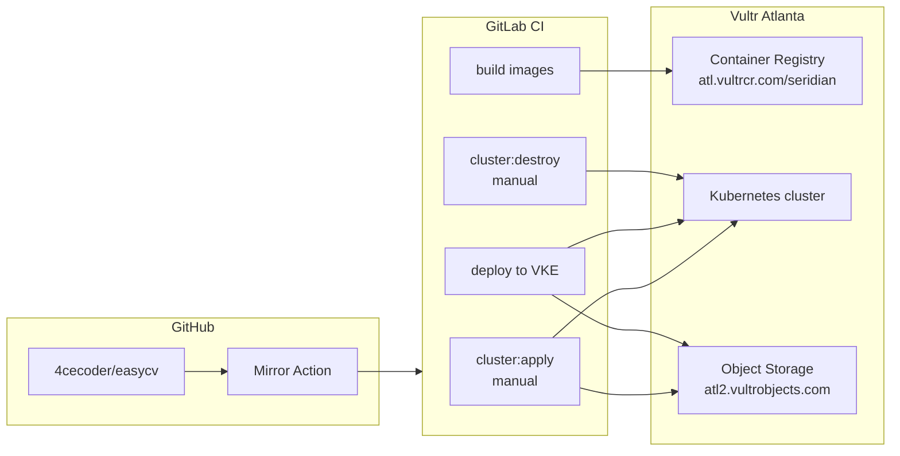
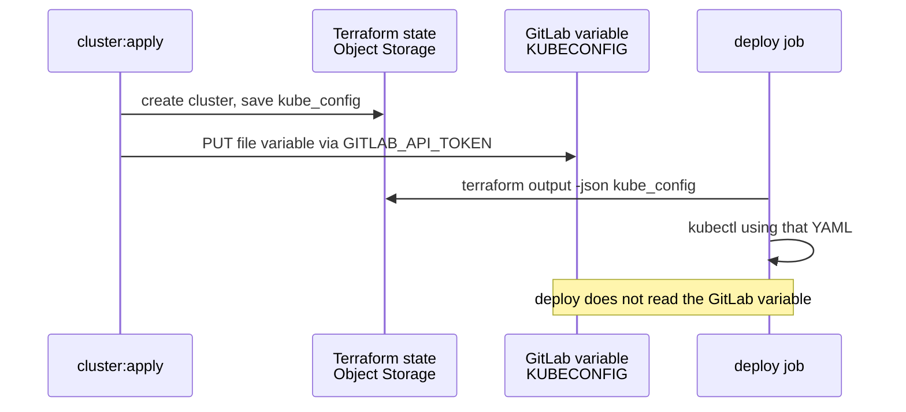

# easyCV infrastructure

This is the operator guide for **how easyCV is hosted, how it is updated, and which secrets do what**.

It is written for someone new to the project. You do not need the product history — only this file, GitLab, and the Vultr dashboard.

> **Two repos, one app.** Application code lives on GitHub. Production CI/CD runs on GitLab. A GitHub Action copies each GitHub push to GitLab.

---

## What you are operating

easyCV is a CV/resume web app:

| Piece | Role |
| --- | --- |
| **Frontend** | Next.js app. Users upload files and preview the result. |
| **Worker** | Python process. Parses CVs, calls an LLM, builds a PDF. |
| **Convex** | Database and file storage (hosted by Convex, not on the cluster). |
| **Cluster** | Vultr Kubernetes Engine (VKE) in Atlanta (`atl`). Runs frontend + worker. |

Users reach the frontend through a **Vultr LoadBalancer** that Kubernetes creates when the `easycv-frontend` Service is applied. Terraform does **not** create that LoadBalancer.

---

## Big picture



| Cloud object | What it is | Why it exists |
| --- | --- | --- |
| **VKE cluster** `easycv` | Kubernetes in `atl`, 2× `vc2-2c-4gb` workers | Runs the app |
| **Container registry** `seridian` | `atl.vultrcr.com/seridian` | Holds Docker images |
| **Object Storage** bucket `easycvtfstate` | S3-compatible, host `atl2.vultrobjects.com` | Holds **Terraform state** (the source of truth for the cluster) |
| **GitLab project** | [gitlab.com/therodfather/easycv](https://gitlab.com/therodfather/easycv) | Builds, deploys, create/destroy cluster |
| **GitHub repo** | [github.com/4cecoder/easycv](https://github.com/4cecoder/easycv) | Canonical git history |

### What not to use

| Thing | Why not |
| --- | --- |
| **Vultr Block Storage** | iSCSI disk. GitLab shared runners cannot attach it. Cannot hold Terraform state. |
| **GitLab HTTP Terraform state** | Used to. It dropped kubeconfig. Do not go back. |
| **Hand-edited `KUBECONFIG` after every cluster create** | `cluster:apply` writes it automatically. GitLab **deploy** does not even use that variable. |

---

## Repos and how code moves

```text
Developer  →  git push GitHub (4cecoder/easycv)
                    │
                    ▼
         GitHub Action “Mirror to GitLab”
                    │
                    ▼
         GitLab (therodfather/easycv) runs CI
```

- **GitHub** is where you open PRs.
- **GitLab** is where production pipelines run (`.gitlab-ci.yml`).
- Mirror workflow: `.github/workflows/mirror-gitlab.yml`. It needs GitHub secret `GITLAB_TOKEN` (GitLab token with `write_repository`).
- GitLab **pull** mirroring from GitHub is not used (GitHub blocked password auth; pull-mirror is also a paid GitLab feature).

If GitLab `master` is behind GitHub, either wait for the mirror Action or check it failed under GitHub → Actions.

---

## Pipeline jobs

Every pipeline on `master` (or a tag) has three stages. Cluster jobs are **manual** and do not block the app deploy.

```text
stage: cluster     cluster:apply     (manual — create / update VKE)
                   cluster:destroy   (manual — delete VKE)

stage: build       build-worker      (Dockerfile at repo root)
                   build-frontend    (web/Dockerfile)

stage: deploy      deploy            (kubectl apply into namespace easycv)
```

`cluster:apply`, `cluster:destroy`, and `deploy` share GitLab **`resource_group: vke`**. Only one of them runs at a time so they cannot corrupt Terraform state.

### `cluster:apply` (create or refresh the cluster)

Play this from a **new** pipeline on current `master`. Do not retry a failed job from an old pipeline — that reuses the old scripts.

1. Terraform talks to Vultr and creates (or no-ops) the VKE cluster.
2. Kubernetes version is **not hard-coded**. Terraform asks Vultr `GET /v2/kubernetes/versions` and uses the latest unless you set `TF_VAR_kubernetes_version`.
3. State is written to Object Storage: `s3://easycvtfstate/vke/terraform.tfstate`.
4. Kubeconfig is decoded from Terraform (Vultr stores it as base64) via `terraform/scripts/export-kubeconfig.sh`.
5. That YAML is uploaded to the GitLab CI/CD **file** variable `KUBECONFIG` via `terraform/scripts/update-gitlab-kubeconfig.sh`.

Success looks like:

```text
Kubeconfig YAML ready (… bytes).
Updated GitLab file variable KUBECONFIG (environment_scope=*).
```

### `cluster:destroy` (tear down)

Deletes **only** what Terraform knows about (the VKE cluster in state). Images in the registry and the Object Storage bucket stay. Recreate later with `cluster:apply`.

A new cluster gets a **new** kubeconfig. Apply will refresh `KUBECONFIG`. Deploy always reads kubeconfig from Terraform state, not from the GitLab variable.

### `build-*` then `deploy` (ship the app)

Runs automatically on `master` / tags.

1. Build and push:
   - `atl.vultrcr.com/seridian/easycv-worker:$SHORT_SHA` and `:latest`
   - `atl.vultrcr.com/seridian/easycv-frontend:$SHORT_SHA` and `:latest`
2. Read Terraform state from Object Storage.
3. Decode kubeconfig, then pin the API server to the cluster **IP** if DNS for `*.vultr-k8s.com` is flaky.
4. Apply `k8s/namespace.yaml`, image-pull secret, app secret, configmap, deployments, and the LoadBalancer Service.
5. Wait for rollouts. Print `kubectl get svc easycv-frontend`.

Frontend image needs **`GITHUB_TOKEN`** at **build** time to install private package `@bytecats/ui-kit`.

---

## How kubeconfig is kept up to date

There are two consumers. They are easy to mix up.

| Consumer | Where kubeconfig comes from |
| --- | --- |
| **GitLab `deploy` job** | Terraform state in Object Storage. Always the live cluster. |
| **GitLab variable `KUBECONFIG`** (Type: File) | Written by `cluster:apply` for kubectl, GitHub Actions, or humans. **Not** used by GitLab deploy. |



GitLab’s built-in `CI_JOB_TOKEN` **cannot** change CI/CD variables. That is why `GITLAB_API_TOKEN` exists (Project Access Token, Maintainer, scope `api`).

After destroy + apply, confirm the variable changed: the server host in the file should match the new `endpoint` from Terraform (example: `<cluster-uuid>.vultr-k8s.com`).

---

## Terraform state

| | |
| --- | --- |
| Backend | S3-compatible Vultr Object Storage |
| Endpoint | `https://atl2.vultrobjects.com` |
| Bucket | `easycvtfstate` |
| Object key | `vke/terraform.tfstate` |
| Dummy AWS region | `us-east-1` (Vultr ignores it; Terraform requires a region) |
| Locking | No DynamoDB. GitLab `resource_group: vke` serializes jobs instead. |

Credentials for the backend are **not** in git. CI maps:

- `VULTR_S3_ACCESS_KEY` → `AWS_ACCESS_KEY_ID`
- `VULTR_S3_SECRET_KEY` → `AWS_SECRET_ACCESS_KEY`

Code: `terraform/versions.tf` (backend) and `terraform/scripts/configure-s3-backend.sh`.

First init after leaving GitLab HTTP state will **copy** the old `vke` HTTP state into the bucket if S3 is empty (`terraform/scripts/gitlab-init.sh`). That migration already ran; leave it in place in case someone stands up a new GitLab project.

### Local Terraform (optional)

```bash
export VULTR_API_KEY=...
export VULTR_S3_ACCESS_KEY=...
export VULTR_S3_SECRET_KEY=...
. ./terraform/scripts/configure-s3-backend.sh
terraform -chdir=terraform init
terraform -chdir=terraform plan
```

Never commit `terraform.tfvars`, `backend.hcl`, `*.tfstate`, or kubeconfig files. They are gitignored.

---

## Cluster defaults

Set in `terraform/terraform.tfvars.example` / variable defaults. Override in GitLab with `TF_VAR_*`.

| Setting | Default |
| --- | --- |
| Region | `atl` (must stay with `atl.vultrcr.com`) |
| Label | `easycv` |
| Kubernetes version | Latest that Vultr currently offers |
| Control plane HA | off |
| Firewall | off |
| Workers | 2 × `vc2-2c-4gb`, label `easycv-workers` |
| Autoscaler | off |

---

## Kubernetes layout

Namespace: **`easycv`**.

| Manifest | What it is |
| --- | --- |
| `k8s/namespace.yaml` | Namespace |
| `k8s/frontend-deployment.yaml` | Next.js, port 3000, 1 replica |
| `k8s/worker-deployment.yaml` | Python worker, **1 replica** (a second replica would double-claim jobs) |
| `k8s/frontend-service.yaml` | `LoadBalancer` port 80 → 3000. Vultr CCM creates the public IP. |

Deploy also creates (not files in git):

| Object | Purpose |
| --- | --- |
| Secret `vultr-registry-credentials` | Pull from the private container registry |
| Secret `easycv-secrets` | Convex URL, worker secret, Stripe, LLM keys |
| ConfigMap `easycv-config` | `NEXT_PUBLIC_CONVEX_URL`, `LLM_PROVIDER`, `LLM_MODEL`, `APP_URL` |

Other YAML under `k8s/` (Convex in-cluster, ingress, Postgres, cert-manager) is **not** applied by the current GitLab `deploy` job. Production Convex is the hosted Convex URL in CI variables.

Public URL: `kubectl get svc easycv-frontend -n easycv`. The `EXTERNAL-IP` can take a few minutes the first time.

---

## GitLab CI/CD variables

Set at **GitLab → Settings → CI/CD → Variables**. Mask secrets. Do not put them in git.

### Required for cluster + deploy

| Variable | Type | Used by | What it is |
| --- | --- | --- | --- |
| `VULTR_API_KEY` | Variable, Masked | `cluster:apply` / `destroy` | **Account** API key (Kubernetes + version list). Not the registry password. |
| `VULTR_S3_ACCESS_KEY` | Variable, Masked | Terraform init, deploy | Object Storage access key |
| `VULTR_S3_SECRET_KEY` | Variable, Masked, Hidden | Terraform init, deploy | Object Storage secret key |
| `GITLAB_API_TOKEN` | Variable, Masked | `cluster:apply` only | Project Access Token, **Maintainer**, scope **`api`**. Updates `KUBECONFIG`. Protected is OK (`apply` only runs on `master`). |
| `VULTRCR_USERNAME` | Variable, Masked | build + deploy | Container registry username |
| `VULTRCR_PASSWORD` | Variable, Masked | build + deploy | Container registry API key |
| `GITHUB_TOKEN` | Variable, Masked | `build-frontend` | GitHub token that can **read** private repo `4cecoder/ui-kit` |

### Required for the app to work once deployed

| Variable | Used by | What it is |
| --- | --- | --- |
| `NEXT_PUBLIC_CONVEX_URL` | Frontend build + runtime ConfigMap/Secret | Public Convex deployment URL |
| `WORKER_SECRET` | Worker | Shared secret so the worker can claim jobs. If unset, deploy **generates a random one** (fine for a demo; set a stable value in production). |

Optional alias: `CONVEX_URL` (defaults to `NEXT_PUBLIC_CONVEX_URL` when creating `easycv-secrets`).

### Optional app / billing / LLM

| Variable | Used by | Notes |
| --- | --- | --- |
| `APP_URL` / `DOMAIN` | Secret + ConfigMap | Public site URL. Defaults to `https://$DOMAIN` or `https://easycv.example.com`. |
| `STRIPE_SECRET_KEY` | Secret | Payments |
| `STRIPE_WEBHOOK_SECRET` | Secret | Stripe webhooks |
| `STRIPE_PRICE_ID` | Secret | One-time price |
| `STRIPE_PRO_PRICE_ID` | Secret | Pro price |
| `OPENAI_API_KEY` | Secret | If `LLM_PROVIDER=openai` |
| `ANTHROPIC_API_KEY` | Secret | If `LLM_PROVIDER=anthropic` |
| `LLM_PROVIDER` | ConfigMap | Deploy default: `openai` |
| `LLM_MODEL` | ConfigMap | Deploy default: `gpt-4o` |
| `OLLAMA_API_BASE` | ConfigMap | Only if using Ollama |

### Written by CI (do not paste by hand each time)

| Variable | Type | Who writes it | Who reads it |
| --- | --- | --- | --- |
| `KUBECONFIG` | **File** | `cluster:apply` | Humans, optional fallback, GitHub Actions if you still use it. **Not** GitLab `deploy`. |

Create it once as Type **File** if it does not exist; apply will update every copy (including environment-scoped ones). Do not mark it Masked (GitLab cannot mask file variables).

### Hard-coded in `.gitlab-ci.yml` (not secrets)

| Name | Value |
| --- | --- |
| Registry host | `atl.vultrcr.com` |
| Registry name | `seridian` |
| K8s namespace | `easycv` |
| Terraform state name (legacy GitLab HTTP id) | `vke` |

---

## How to create `GITLAB_API_TOKEN`

One-time:

1. GitLab project → **Settings → Access Tokens**.
2. Name e.g. `ci-kubeconfig`. Role **Maintainer**. Scope **`api`**.
3. **Settings → CI/CD → Variables** → `GITLAB_API_TOKEN`, Masked.

Without this, `cluster:apply` still creates the cluster, then fails when it cannot update `KUBECONFIG`. Re-run apply after adding the token (Terraform will be a no-op).

---

## Day-to-day runbooks

### Ship a code change

1. Merge to GitHub `master`.
2. Confirm GitLab `master` has the commit (mirror Action).
3. Wait for **build** + **deploy** on that pipeline.
4. `kubectl get pods -n easycv` or check the LoadBalancer IP.

You do **not** need `cluster:apply` unless you destroyed the cluster or are changing node size/count.

### Create a cluster from scratch

1. Confirm Object Storage keys and `VULTR_API_KEY` are set.
2. New pipeline on `master` → play **`cluster:apply`**.
3. Wait until nodes are `active` (job timeout 45m).
4. Confirm logs: `Kubeconfig YAML ready` and `Updated GitLab file variable KUBECONFIG`.
5. Let **deploy** run (or play it if it ran before the cluster existed).

### Destroy the cluster (stop spend)

1. Play **`cluster:destroy`** on current `master`.
2. Confirm in Vultr → Kubernetes that `easycv` is gone.
3. Registry images and `easycvtfstate` remain (cheap). Delete those in Vultr only if you intend to abandon the project.

### After destroy, bring it back

1. `cluster:apply` (new cluster UUID and kubeconfig).
2. `deploy` (or a new master pipeline).

### Change worker size or count

Set a CI variable for one pipeline, or add a persistent `TF_VAR_*`:

| Variable | Example |
| --- | --- |
| `TF_VAR_node_quantity` | `3` |
| `TF_VAR_node_plan` | `vc2-4c-8gb` |
| `TF_VAR_kubernetes_version` | `v1.36.1+3` (only if you must pin) |

Then play `cluster:apply`.

---

## Replicating this setup on a new Vultr account

1. **Container registry** in `atl`. Note username + API key → `VULTRCR_*`.
2. **Object Storage** in a region that gives you an S3 hostname (this project uses `atl2.vultrobjects.com`). Create bucket **`easycvtfstate`**. Put access/secret keys in GitLab. If the hostname/bucket change, edit `terraform/versions.tf` and `configure-s3-backend.sh`.
3. **Account API key** → `VULTR_API_KEY` (Kubernetes).
4. **GitLab project** with this repo; set all required variables above.
5. **GitHub → GitLab mirror** (`GITLAB_TOKEN` on GitHub).
6. Play `cluster:apply`, then let `deploy` run.
7. Point DNS at the LoadBalancer IP if you have a domain.

Do **not** create a duplicate cluster in the Vultr UI for the same app. Terraform will not adopt a hand-made cluster; `destroy` would not delete it.

---

## File map

```text
.gitlab-ci.yml                          build + deploy
terraform/.gitlab-ci.yml                cluster:apply / cluster:destroy
terraform/versions.tf                   S3 backend + Vultr provider
terraform/main.tf                       vultr_kubernetes.easycv
terraform/outputs.tf                    cluster_id, endpoint, kube_config, …
terraform/scripts/configure-s3-backend.sh   export AWS keys from VULTR_S3_*
terraform/scripts/gitlab-init.sh        init + one-time GitLab HTTP → S3 copy
terraform/scripts/export-kubeconfig.sh  YAML kubeconfig from state (decode base64)
terraform/scripts/update-gitlab-kubeconfig.sh  PUT GitLab KUBECONFIG file variable
k8s/                                    what deploy applies (namespace, apps, LB)
.github/workflows/mirror-gitlab.yml     GitHub → GitLab push
```

---

## Troubleshooting

| Symptom | Likely cause | What to do |
| --- | --- | --- |
| Deploy: `dial tcp 127.0.0.1:6443` or stale `*.vultr-k8s.com` | Old kubeconfig / wrong cluster | Deploy should read **state**, not the GitLab variable. Re-run `cluster:apply` on **current** `master`, then deploy. |
| `Refusing to upload … does not look like a kubeconfig` | Old pipeline SHA | Do not retry the failed job. Run a **new** pipeline on latest `master`. |
| `GITLAB_API_TOKEN is not set` | Missing project token | Add Maintainer + `api` token. Re-run apply. |
| HTTP 401/403 listing CI variables | Token too weak | Maintainer + `api`, not `CI_JOB_TOKEN`. |
| `Invalid K8 version` | Pinned version Vultr no longer offers | Unset `TF_VAR_kubernetes_version` so Terraform picks latest. |
| Frontend build cannot find `@bytecats/ui-kit` | `GITHUB_TOKEN` missing or no repo read | Fine-grained or classic token with access to `4cecoder/ui-kit`. |
| Worker crash-loop | Missing Convex URL or `WORKER_SECRET` | Set variables; check `kubectl logs -n easycv deploy/easycv-worker`. |
| Images `ImagePullBackOff` | Registry secret wrong | Check `VULTRCR_USERNAME` / `PASSWORD`. |
| Two clusters in Vultr | One made by hand, one by Terraform | Destroy only the Terraform one with `cluster:destroy`. Delete the other in the Vultr UI. |
| GitLab has no latest GitHub commits | Mirror Action failed | GitHub → Actions → “Mirror to GitLab”. Secret `GITLAB_TOKEN` must be able to push `master`. |

---

## Safety notes

- Never commit kubeconfig, `*.tfstate`, Object Storage keys, or `VULTR_API_KEY`.
- `terraform output` prints `kube_config = <sensitive>` on purpose. Do not add a non-sensitive output for it — apply logs would leak cluster credentials.
- `cluster:destroy` is irreversible for that cluster. State in Object Storage is what Terraform will destroy; if state is empty, destroy is a no-op and a live cluster could be left behind (orphaned).
- Prefer **new pipelines** after merging infra changes. Retrying an old job runs old scripts against a new cluster.
