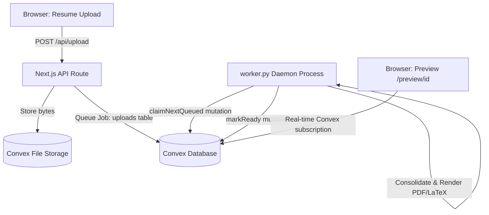

# System Architecture

The easyCV platform uses a microservices hybrid stack leveraging Next.js (App Router), Convex database backend, and a long-polling Python daemon worker.

## Architecture Diagram

## Key Components

1. **Frontend & REST API Gateway**:
   - Next.js (React Server Components + Client Hooks).
   - Serves the file-upload pipeline and displays live updates reactively through Convex queries.
   - Gates resume downloads behind a Stripe one-time checkout (or admin passcode bypass token).
2. **Database & File Storage Layer (Convex)**:
   - Convex serves as both the document database and Blob storage provider.
   - Tables: `uploads`, `resumeFiles`, `structuredProfiles`, `payments`.
3. **Background Processing Worker (`worker.py`)**:
   - Polling worker daemon written in Python.
   - Grabs queued jobs from Convex, downloads files, extracts text, consolidates them via LLM APIs into structured JSON schema, and compiles the final TeX code to a PDF document.
